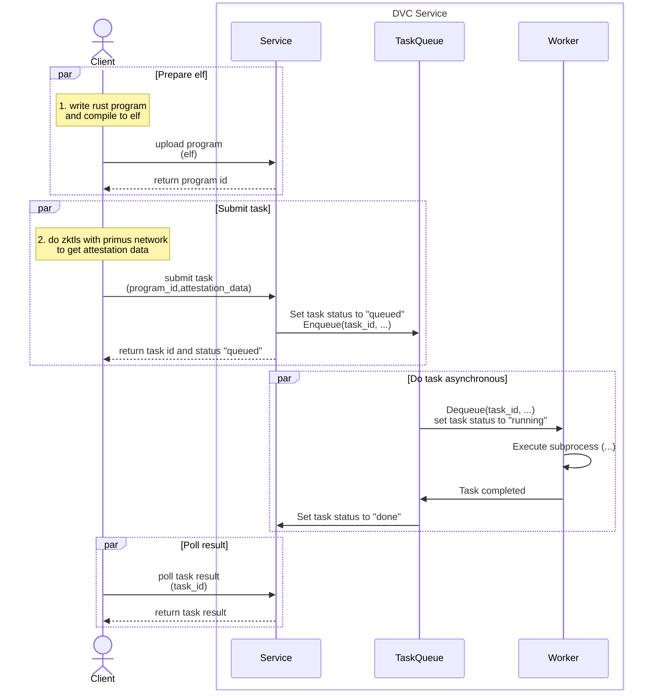

# Primus DVC Demo

## Overview

## Basic Workflow

- **Write program**
  1. Write a Program in Rust and compile it into an ELF.
  2. Upload the ELF generated in Step 1 to DVC-Service. The service will return a program ID.
- **Execute ZKTLS and submit proof task**
  1. Write the client code to interact with the Primus Network using ZKTLS to generate the attestation data.
  2. Submit the program ID and attestation data from the previous steps to the Service.
  3. Query the results.

See [Quick Start](./dvc-client/README.md#quick-start) for more details.

 

**NOTES:**
- The `Client` interacts via the **ProverClient(SDK)**.

## Components

- [dvc-client](./dvc-client/README.md)
- [dvc-service](./dvc-service/README.md)
- program:
  - [dvc-brevis-program](./dvc-brevis-program/README.md)
  - [dvc-succinct-program](./dvc-succinct-program/README.md)
- prover:
  - [dvc-brevis-prover](./dvc-brevis-prover/README.md)
  - [dvc-succinct-prover](./dvc-succinct-prover/README.md)

