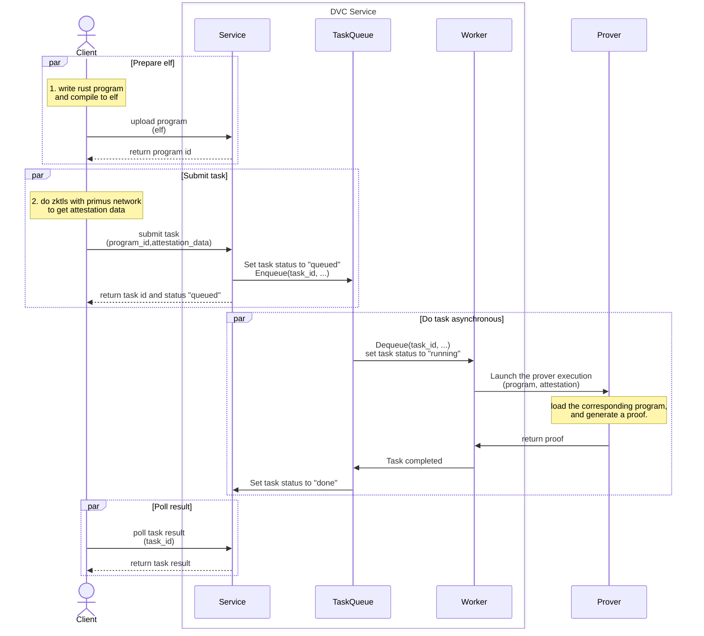

# Primus DVC Demo

## Overview

DVC (data verification and computation) allows verified personal data to be computed in a privacy-preserving way. Primus DVC uses zkTLS and zkVM to support this capability in a plugable mode. Developers can use different zkTLS algorithms (MPC-TLS or Proxy-TLS) and different zkVM providers (e.g., Succinct, Brevis, etc) to customize their business use case. 

## The Idea
Primus zkTLS enables DVC by passing user data attestation and its hash value to the zkVM, where the zk proof is generated on the private data and its metadata restrictions. For instance, if a user wants to prove his bank balance is over 10 USD. He can first create a zkTLS attestation and its hash value about the balance raw data， and then create a verifiable zk proof through a zkVM program towards the raw data to demonstrate the balance is over 10 USD. The program shall also check the validity of the attestation by checking the hash consistency.

## Basic Workflow

- **Write program**
  1. Write a Program in Rust and compile it into an ELF.
  2. Upload the ELF generated in Step 1 to DVC-Service. The service will return a program ID.
- **Execute ZKTLS and submit proof task**
  1. Write the client code to interact with the Primus Network using ZKTLS to generate the attestation data.
  2. Submit the program ID and attestation data from the previous steps to the Service.
  3. Query the results.

See [Quick Start](./dvc-client/README.md#quick-start) for more details.

 

**NOTES:**
- The `Client` interacts via the **ProverClient(SDK)**.

## Components

- [dvc-client](./dvc-client/README.md)
- [dvc-service](./dvc-service/README.md), running inside TEE
- program:
  - [dvc-brevis-program](./dvc-brevis-program/README.md)
  - [dvc-succinct-program](./dvc-succinct-program/README.md)
- prover: the execution of your program to generate zero-knowledge proofs (ZKPs).
  - [dvc-brevis-prover](./dvc-brevis-prover/README.md)
  - [dvc-succinct-prover](./dvc-succinct-prover/README.md)

## Developer Guide
The following document gives a step-by-step guide on how to create a zk proof with a zkTLS attestation locally.
- [Developer's Guide](./DEVELOPER_GUIDE.md).
