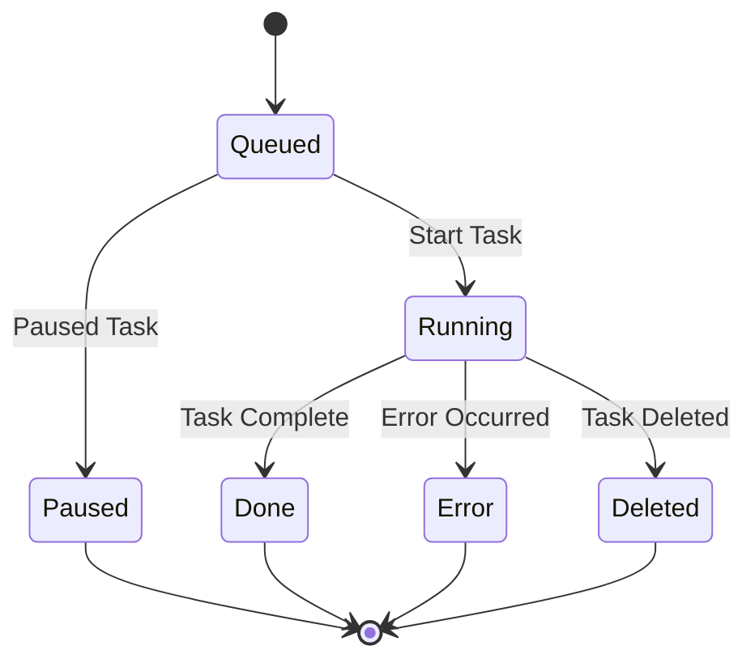

## Overview

**Features:**
✅ Upload binary files
✅ Support up to N concurrent tasks
✅ Task state persistence: resume unfinished tasks after restart
✅ Reject new tasks when the queue is full
✅ Cancel tasks waiting in the queue
⚪ Support callbacks upon task completion
⚪ Deployable with Docker
⚪ ... 


## How to Run

- Install dependencies:

```sh
pip install -r requirements.txt
```

- Set up:

Copy `.env.example` to `.env`. Refer [here](../dvc-succinct-prover/README.md) to compile prover and set `SUCCINCT_PROVER_BIN`.


- Run the app:

```sh
uvicorn main:app --host 0.0.0.0 --port 38080
# enable ssl by pass: --ssl-keyfile certs/server.key --ssl-certfile certs/server.crt
```

Access docs at: `http://localhost:38080/docs` for interactive API testing.


## User Guide

**Uploading a Program:**

- **Endpoint**: `POST /uploadProgram`
- **Request**: Upload elf binary file along with metadata (name, version, description).
- **Response**: Returns `program_id`(uuid) and `uploaded_at` timestamp.

**Listing Programs:**

- **Endpoint**: `GET /listPrograms`
- **Response**: Returns a list of all programs with metadata.

**Submit a Task:**

- **Endpoint**: `POST /submitTask`
- **Request**: Provide `program_id`, attestation data.
- **Response**: Returns task ID and status("queued").

**Listing Tasks:**

- **Endpoint**: `GET /listTasks`
- **Request**: Provide one of `queued, running, done`.
- **Response**: Returns a list of all tasks.

**Getting Task Result:**

- **Endpoint**: `GET /getResult`
- **Request**: Provide `task_id`.
- **Response**: Returns task result.


## Task State


